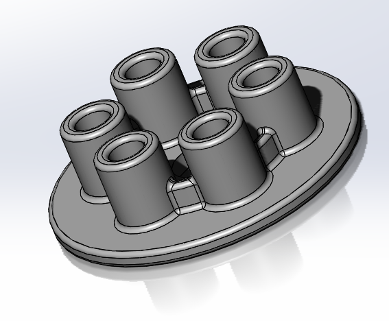
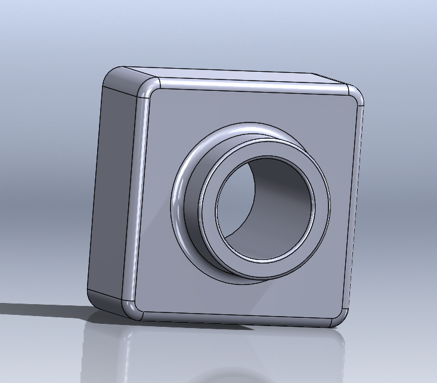
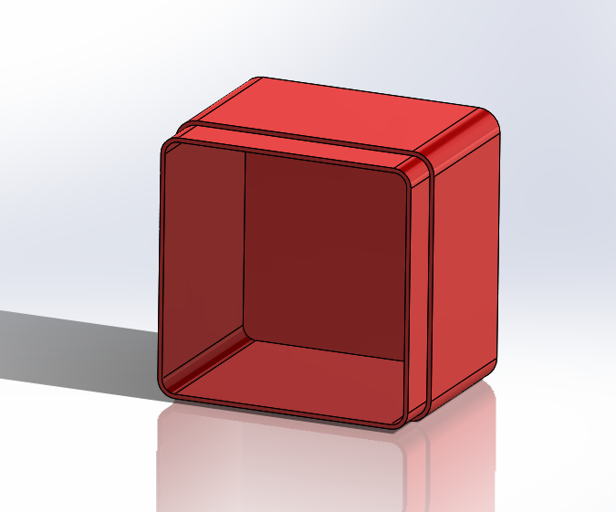

# NotSoBasicCad

### Description

  NotSoBasicCad was the module for the CAD assignments we needed
to complete before moving on to the ultrasonic project. It really
took my understanding of Solidworks a lot farther than last year
in Engineering 1.

## A Little Practice

  A Little Practice was actually a collection of tutorials on Solidworks
that we were required to work through. Going through these tutorials
gave me more practice with Solidworks of course, but when it tells you
to use a certain tool, it would highlight where that tool is found
on the toolbar.

  These are the individual Solidworks tutorials:

* Pressure plate
* Lesson 1 and Lesson 2
* Lesson 1 and 2 assembly

### Pressure Plate

### Description

  The pressure plate tutorial made a little plate with little cylinders
on the top. This was some practice with patterning features in a circle
around an axis of symmetry, and using/patterning filets.

### Lessons Learned

  The main thing I learned was a little but pretty helping tip when
patterning features in a circle. When selecting an axis of symmetry
(the axis around which you pattern the feature), you might not always
find one. A little tip is go to the very top of the screen to "view"
then under "hide/show" and show "temporary axis". This will most likely
provide you an axis of symmetry.

### Lesson 1 Screenshot

### Lesson 2 Screenshot

### Description

  Lesson 1 and lesson 2 were making two different lego-like pieces
that would fit together in the assembly tutorial.

### Lessons Learned (pun hath been intended)((Lesson 1 and 2))

  The main thing I learned from thoses tutorials was the shell tool,
which allows you to make a solid object hollow, or make it thin and open
on one side. To use, you select the faces you want to shell, and the diameter
thickness you want to keep on the inside.

### Lesson 1 and 2 Assembly

****Put screenshot of the finished assembly here

### Description

  The assembly tutorial was all about using mates to align and put
together the two pieces.

### Lessons Learned

  The main thing I learned that was very helpful in assembling the pieces was
how when you are inserting a new part into the assembly, you can change its
orientation. When inserting a part into the assembly, there will be Y, X, and Z
buttons at the bottom left corner of the screen. Changing the orientation of 
the part when inserting it will save you a lot of extra work when putting the
part into place.
